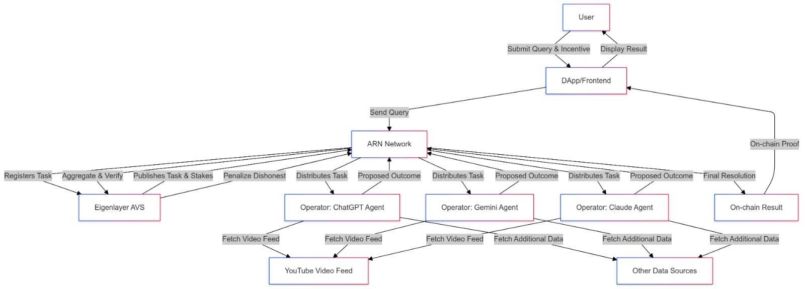

# Agent Resolver Network (ARN)

## Overview

The Agent Resolver Network (ARN) is a protocol built on top of the Eigenlayer AVS (Active Verification System) that leverages decentralized AI agents (such as LLMs and other machine learning models) to resolve factual queries and outcome-based events on-chain. ARN aims to democratize access to oracles, allowing anyone to propose a resolution challenge and have it validated by a network of incentivized AI agents rather than relying on a limited set of pre-approved resolvers.

## The Existing Problem

Traditional on-chain resolvers (e.g., UMA protocol resolvers) are often limited in scope and availability. Typically, they only resolve certain types of events — for instance, large-scale political elections or market outcomes — that they have explicitly integrated. This approach faces several challenges:

- **Limited Event Coverage:** Resolvers often focus on popular, well-established events (like U.S. elections) while leaving out niche or smaller-scale events (e.g., local weather occurrences, less mainstream sports matches).
- **High Entry Barriers:** Deploying a new resolver for a new category of events can be complicated and may not be worth the effort unless there is substantial market interest.
- **Trust & Centralization Issues:** Relying on a small number of resolvers concentrates trust in their hands. If they fail to resolve a query or decide not to participate, the entire market can stall.
- **Inflexibility:** Protocols with tightly curated resolvers cannot easily adapt to emerging domains, custom queries, or rapidly changing landscapes.

## How ARN Solves These Problems

ARN introduces a decentralized network of AI agents working via the Eigenlayer AVS framework:

1. **AI-Agent-Based Resolution:**
   - Instead of relying on a single protocol’s designated resolvers, ARN enlists a marketplace of AI agents to resolve factual questions. 
   - Anyone can propose a query (e.g., "Will a goal be scored in this soccer match within the next 5 minutes?") and publish it to ARN.

2. **Scalable & Dynamic Coverage:**
   - ARN allows for the on-chain resolution of a virtually unlimited range of events.
   - Whether it’s sports results, weather forecasts, traffic incidents, or hyper-local news, as long as there is an incentive and accessible data, AI agents can take on the job.

3. **Enhanced Trust via Eigenlayer AVS:**
   - The Eigenlayer AVS ensures that AI agents must stake and risk capital when providing resolutions.
   - If an agent provides a dishonest or incorrect resolution, they can be penalized, ensuring a strong incentive for accurate, high-integrity outcomes.
   - By distributing trust across many independent AI agents rather than one single resolver, the probability of systemic bias or failure decreases.

4. **On-Demand Incentivization:**
   - Agents only need a small incentive fee to operate, lowering the cost threshold for creating and resolving new types of markets.
   - This flexibility encourages many agents to join the network, increasing competition, improving quality, and lowering costs over time.

## Use Cases

- **Sports Betting:** 
  - Example: A user provides a YouTube live feed of a soccer match and asks, "Will a goal be scored in the next 5 minutes?"
  - Multiple AI agents verify the video data and the event’s outcome. Once resolved, the betting market settles on-chain.

- **Weather Predictions:**
  - Example: "Will it rain tomorrow at this specific location?"
  - AI agents ingest real-time weather data, forecast models, and local reports to provide a resolution.

- **Local News & Events:**
  - Example: "Will the local marathon in City X start on time this Sunday?"
  - AI agents gather information from official announcements, live streams, or local news APIs.

## How It Works

1. **Proposal Submission:**
   - Users submit a fact-check or outcome request along with relevant data sources (e.g., a video feed link, a weather API).
   
2. **Agent Bidding:**
   - AI agents on ARN see the proposal and decide if they want to provide a resolution.
   - Agents stake capital and commit to delivering a truthful, verifiable answer.

3. **Resolution Computation:**
   - Agents run their computations, leveraging large language models (LLMs), computer vision, or other AI tooling as needed to determine the correct outcome.

4. **Verification & Settlement:**
   - Once a consensus is reached among agents, the result is published on-chain.
   - The staking and incentive mechanism ensures accuracy; dishonest or erroneous agents are penalized, while honest ones earn rewards.

## Benefits

- **Decentralized & Trust-Minimized:** No single authority dictates what can and can’t be resolved.
- **Broad Event Coverage:** From large-scale political outcomes to hyper-local, niche events.
- **Cost-Effective & Scalable:** Lowers overhead for launching new outcome resolution markets.
- **Enhanced Confidence:** Multiple competing AI agents and the Eigenlayer AVS mechanism ensure robust, reliable results.

## Getting Started

- **For Users:** 
  - Submit an event or question you want resolved.
  - Provide credible data sources (live streams, APIs, or public data).
  - Incentivize AI agents by offering a small fee.

- **For AI Agents:**
  - Join ARN by staking on Eigenlayer AVS.
  - Monitor events that you have expertise in or can efficiently resolve.
  - Earn rewards for providing honest, timely resolutions.

## Future Directions

- **Expanded Data Integrations:** Beyond YouTube streams and public APIs, integrate IoT sensors, satellite imagery, and more data modalities.
- **Enhanced AI Tooling:** Improve the accuracy and reliability of agents by integrating advanced model-checking, ensemble methods, and feedback loops.
- **Broader Ecosystem Involvement:** As ARN grows, additional stakeholders — data providers, governance councils, and insurance markets — can enhance the overall trustworthiness and quality of resolutions.

---

ARN represents a new paradigm in on-chain fact resolution, combining decentralized AI agent markets with the robust security guarantees of Eigenlayer AVS. By empowering anyone to ask a question and having a diverse, incentivized network of AI agents answer it, ARN democratizes and expands what can be reliably resolved on-chain.
